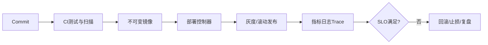

# 云原生、DevOps 与可观测性：从零开始的阶段导学

> 这一页是本阶段的入口，不假设读者已经接触过对应框架。先建立“为什么需要它、它在链路中的位置、如何验证”的心智模型，再进入各专题。

## 1. 本阶段解决什么问题

让同一不可变制品从 CI 进入运行平台，并在发布、扩缩容、故障和回滚过程中保持可观察、可控制。重点不是记 YAML，而是理解镜像、调度、网络、配置、健康、遥测和 SLO 的契约。

### 前置知识

- 能构建可运行 jar 和容器镜像
- 理解进程、端口、HTTP 与数据库迁移

## 2. 零基础词汇与心智模型

### 1. 不可变制品

同一提交生成带摘要的镜像，环境差异通过外部配置注入，不在部署时重新编译。

**学会的证据：** 能从运行实例追溯到提交、构建和镜像摘要。

### 2. 声明式编排

Kubernetes 控制器持续把实际状态收敛到期望状态；Pod 是可替换实例，不应保存唯一持久数据。

**学会的证据：** 能解释 Deployment 滚动更新和 Service 选择器。

### 3. 探针与优雅停机

readiness 决定是否接流量，liveness 判断是否需重启；终止时先停止接流量再完成在途请求。

**学会的证据：** 能验证 SIGTERM、宽限期和连接排空。

### 4. 可观测性与 SLO

日志、指标和 trace 是回答未知问题的遥测；SLO 用用户可感知指标定义可靠性目标和错误预算。

**学会的证据：** 能从告警跳到仪表盘、trace、日志与 runbook。

## 3. 建议学习顺序

1. 构建小型安全镜像
2. 学习 Pod/Deployment/Service/配置/探针
3. 建立 CI/CD 与数据库迁移策略
4. 接入 OpenTelemetry、SLO 和故障响应

## 4. 完整链路



## 5. 最小代码切片

```yaml
readinessProbe:
  httpGet: { path: /actuator/health/readiness, port: 8080 }
livenessProbe:
  httpGet: { path: /actuator/health/liveness, port: 8080 }
```

## 6. 第一个可验证练习

将服务容器化并部署到本地集群；配置 readiness/liveness，滚动更新时持续请求，观察是否出现失败；随后让数据库不可用，验证探针和告警行为。

## 7. 初学者容易混淆的边界

- liveness 依赖所有下游会造成重启风暴
- latest 标签不提供不可变版本
- 有仪表盘但没有可执行告警与 runbook 不等于可运维

## 8. 阶段验收

- [ ] 能解释控制器收敛
- [ ] 能设计安全发布和回滚
- [ ] 能用遥测定位一次跨服务慢请求

## 参考资料

- [Kubernetes Concepts](https://kubernetes.io/docs/concepts/)
- [OpenTelemetry Documentation](https://opentelemetry.io/docs/)
- [Spring Boot Container Images](https://docs.spring.io/spring-boot/reference/packaging/container-images/)
