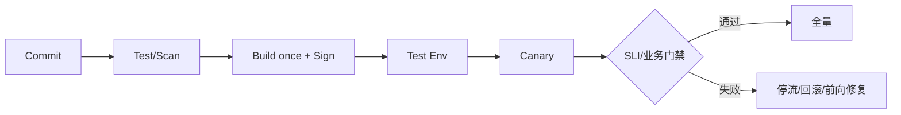

# CI/CD、发布策略、数据库迁移与回滚

可靠交付把同一受验证制品从构建推进到环境，通过自动门禁、渐进流量和可执行回滚降低变更风险。

## 1. 本文覆盖范围

- CI 验证与制品
- CD 环境晋级
- rolling/blue-green/canary
- 数据库兼容迁移与回滚

## 2. 核心知识详解

### 1. CI 与制品

每次提交执行格式、静态检查、单元/集成/安全测试，构建一次不可变制品并附 SBOM、签名和 commit。

- 缓存只加速且不改变依赖结果。
- 分支保护和评审按风险设置。
- 失败日志脱敏并保留足够定位信息。

**正确性边界：** 在每个环境重新构建会导致测试制品与生产制品不一致。

### 2. 环境晋级

CD 按相同 digest 从测试、预发推进生产，配置差异来自受控环境声明。批准可以自动基于策略或人工处理高风险变更。

- 部署前检查容量、依赖和迁移兼容。
- 部署后执行 smoke/关键 SLI 验证。
- 发布记录关联变更、责任人和运行指标。

**正确性边界：** 环境完全相同不现实，关键是差异显式、版本化并可测试。

### 3. 渐进发布

rolling 逐批替换；blue-green 切换整套环境；canary 逐步扩大真实流量。选择取决于容量、状态、成本和路由能力。

- 按错误率、延迟和业务指标自动停止。
- canary 样本量和用户分群避免误判。
- 回滚包括应用、配置、路由和消费者版本。

**正确性边界：** 流量切回旧版本不自动撤销新版本写入的数据或外部副作用。

### 4. 数据迁移

expand/contract 先添加兼容结构和双读/双写或回填，再切换读取，最后在旧版本退出后删除旧结构。

- 迁移锁和耗时在生产规模副本上测试。
- 回填可暂停、重入、限速和校验。
- 删除列/事件字段经过消费者兼容窗口。

**正确性边界：** 破坏性 DDL 常缺少即时回滚；应设计前向修复和数据备份验证。

## 3. 工程链路

## 4. 实践与验证

1. 设计可兼容两个应用版本的字段迁移。
2. 为 canary 设置错误率、p99 和业务转化门禁。
3. 演练应用回滚但数据已由新版本写入的处理。

## 5. 掌握检查

- [ ] 能实现 build once。
- [ ] 能选择发布策略。
- [ ] 能设自动停止条件。
- [ ] 能设计 expand/contract。

## 参考资料

- [GitHub Actions](https://docs.github.com/en/actions)
- [Argo Rollouts](https://argo-rollouts.readthedocs.io/)
- [Flyway Documentation](https://documentation.red-gate.com/flyway)
