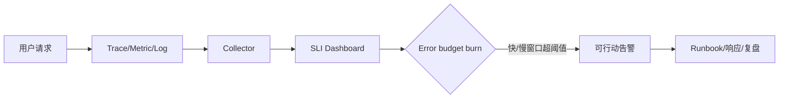

# OpenTelemetry、SLO、告警与故障响应

可观测性从服务目标和诊断问题出发，用日志、指标、追踪和 profile 提供证据，再以告警和 runbook 驱动响应。

## 1. 本文覆盖范围

- Telemetry 与 context propagation
- RED/USE 与业务指标
- SLI/SLO/error budget
- 告警、事故指挥和复盘

## 2. 核心知识详解

### 1. OpenTelemetry

OTel 提供 API、SDK、语义约定、OTLP 和 Collector，把 trace、metric、log 上下文跨进程关联。

- 自动 instrumentation 与手工业务 span 配合。
- resource 标识 service/version/environment。
- collector 负责批量、重试、过滤和导出，设有界队列。

**正确性边界：** 采集成功不代表数据有用；span 名、属性基数和业务语义需要设计。

### 2. 指标和关联

入口用 Rate/Errors/Duration，资源用 Utilization/Saturation/Errors，关键业务状态另设指标。trace id 连接日志与调用链。

- 标签只用有界枚举，不用 userId/orderId。
- histogram 桶与 SLO 阈值对齐。
- 日志记录决策和异常，metric 负责聚合趋势。

**正确性边界：** 百分位不能通过实例百分位取平均得到全局百分位，使用可聚合直方图。

### 3. SLI/SLO 与错误预算

SLI 是用户可感知测量，SLO 是目标，错误预算表示目标窗口允许的不良事件。多窗口 burn-rate 告警兼顾速度和置信。

- 从成功率、可用性、正确性、延迟和新鲜度选 SLI。
- 计划停机是否计入由产品承诺决定。
- 预算消耗影响发布速度和可靠性投资。

**正确性边界：** SLO 不是 100%；不可实现的目标会导致告警疲劳和错误优先级。

### 4. 事故响应

告警应可行动，包含影响、仪表盘、变更和 runbook。事故中明确指挥、沟通、操作和记录角色，恢复后做无责复盘。

- 先限制影响，再恢复，再找根因。
- 操作带时间线、审批和回滚。
- 复盘产出有所有者/期限的系统改进。

**正确性边界：** 复盘只写“加强注意”不会降低复发概率；行动应修改系统、测试、门禁或监控。

## 3. 工程链路



## 4. 最小可运行示例

下面的示例只保留关键路径。把它放入对应版本的最小工程，先运行测试或命令确认行为，再逐步加入重试、超时、监控和异常分支。

```yaml
receivers:
  otlp:
    protocols: { grpc: {}, http: {} }
processors:
  batch: {}
exporters:
  otlphttp:
    endpoint: ${OBSERVABILITY_ENDPOINT}
service:
  pipelines:
    traces: { receivers: [otlp], processors: [batch], exporters: [otlphttp] }
```

## 5. 实践与验证

1. 为登录服务定义可用性和延迟 SLI/SLO。
2. 接入 OTel 并验证 HTTP、数据库和消息 context。
3. 写一份含停止条件、回滚和沟通的故障 runbook。

## 6. 掌握检查

- [ ] 能控制属性基数。
- [ ] 能定义用户导向 SLI。
- [ ] 能使用错误预算。
- [ ] 能运行可复盘事故响应。

## 参考资料

- [OpenTelemetry Java](https://opentelemetry.io/docs/languages/java/)
- [OpenTelemetry Semantic Conventions](https://opentelemetry.io/docs/specs/semconv/)
- [Google SRE Workbook: Alerting on SLOs](https://sre.google/workbook/alerting-on-slos/)
