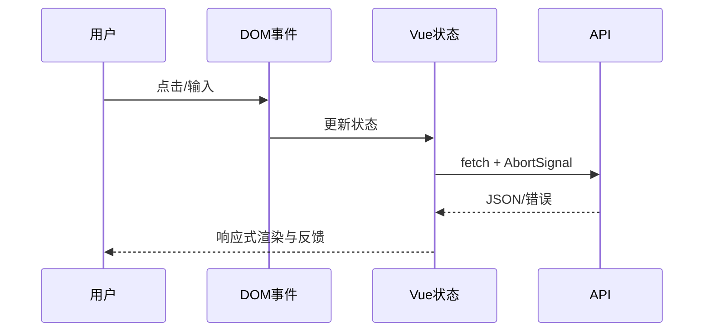

# 前端基础与全栈交付：从零开始的阶段导学

> 这一页是本阶段的入口，不假设读者已经接触过对应框架。先建立“为什么需要它、它在链路中的位置、如何验证”的心智模型，再进入各专题。

## 1. 本阶段解决什么问题

让后端学习者理解浏览器如何解析 HTML、应用 CSS、执行 JavaScript、调用 API 并维护界面状态。学习目标是构建可访问、响应式、类型安全、可测试的管理界面，并准确处理认证、错误、上传下载与实时连接。

### 前置知识

- 理解 HTTP、JSON 与 REST API
- 掌握变量、函数、集合和异常等通用编程概念

## 2. 零基础词汇与心智模型

### 1. 语义 HTML

HTML 描述文档结构与控件语义，正确元素为键盘、读屏器、搜索与默认交互提供基础。

**学会的证据：** 能用 label、button、nav、main 和表格语义构建页面。

### 2. CSS 级联与布局

选择器、来源、层叠层、优先级和源码顺序共同决定样式；Flexbox 与 Grid 解决不同维度的布局。

**学会的证据：** 能在不堆叠 `!important` 的情况下解释计算样式。

### 3. JavaScript 运行模型

浏览器在事件循环中执行任务；Promise 回调进入微任务队列，DOM、网络和计时器由 Web API 协作。

**学会的证据：** 能解释 await 前后执行顺序和取消过期请求。

### 4. 响应式状态

Vue 用 ref/reactive/computed 描述状态与派生值，用组件 props/emit 形成单向数据流。

**学会的证据：** 能避免把可计算值重复存储并正确清理副作用。

## 3. 建议学习顺序

1. HTML 语义、表单和可访问性
2. CSS 盒模型、级联、Flex/Grid 和响应式
3. JavaScript 类型、函数、DOM、模块和异步
4. TypeScript 与 Vue 组件
5. 接口契约、测试、性能和部署

## 4. 完整链路



## 5. 最小代码切片

```typescript
type LoadState<T> =
  | { status: 'loading' }
  | { status: 'success'; data: T }
  | { status: 'error'; message: string }
```

## 6. 第一个可验证练习

实现可键盘操作的订单列表：包含筛选表单、加载/空/错误状态、分页、取消旧请求和响应式布局；用浏览器开发工具检查网络、可访问树和布局。

## 7. 初学者容易混淆的边界

- `div` 加点击事件不自动具备 button 的键盘语义
- TypeScript 类型不会在运行时自动校验服务器 JSON
- 把所有状态放全局会增加耦合和生命周期问题

## 8. 阶段验收

- [ ] 能构建语义表单和响应式布局
- [ ] 能解释事件循环与 Promise
- [ ] 能设计类型化 Vue 组件和 API 状态

## 参考资料

- [MDN Learn Web Development](https://developer.mozilla.org/en-US/docs/Learn_web_development)
- [JavaScript Guide](https://developer.mozilla.org/en-US/docs/Web/JavaScript/Guide)
- [Vue Guide](https://vuejs.org/guide/introduction.html)
