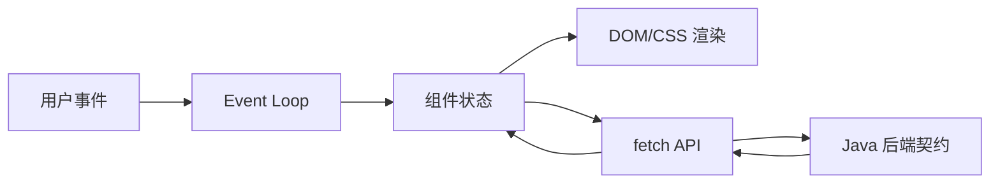

# Web、HTML、CSS、JavaScript 与 TypeScript 基础

浏览器通过 HTML 语义、CSS 布局和 JavaScript 事件/异步模型呈现应用；TypeScript 在构建期提供类型检查。

## 1. 本文覆盖范围

- HTTP 与浏览器安全模型
- 语义 HTML 与可访问性
- CSS 布局与响应式
- JavaScript/TypeScript 模块、事件循环和类型

## 2. 核心知识详解

### 1. 浏览器和 HTTP

导航和 fetch 经过 DNS、连接、TLS、HTTP、缓存、cookie 和同源策略；前端看到的错误可能来自任一层。

- DevTools Network 检查方法、状态、header、timing 和缓存。
- 正确使用语义状态码和内容类型。
- CSP、同源、CORS 与 cookie 属性共同约束脚本和请求。

**正确性边界：** CORS 由浏览器执行，服务器间调用不受其保护；后端仍需认证授权。

### 2. HTML 与可访问性

使用 heading、nav、main、form、label、button、table 等语义元素，让键盘和辅助技术理解结构。

- 表单控件有 label、错误关联和焦点管理。
- 按钮执行动作，链接导航。
- 图片提供适当 alt，装饰图为空 alt。

**正确性边界：** 给 div 添加 click 不会自动获得按钮的键盘、焦点和语义行为。

### 3. CSS 布局

box model、normal flow、Flexbox、Grid、container/media query 构成现代布局；设计 token 管理颜色、间距和字体。

- 移动优先并测试缩放、长文本和暗色模式。
- 避免固定高度截断动态内容。
- 颜色对比和 focus-visible 可验证。

**正确性边界：** 响应式不是按设备品牌写断点，而是按内容在可用空间中的布局需求。

### 4. JavaScript 与 TypeScript

事件循环协调 task/microtask；Promise/async 处理异步。TypeScript 用 union、generic、narrowing 和 strict mode 在编译期约束数据。

- API 响应仍在运行时验证，类型声明不会验证网络 JSON。
- ES modules 显式导入导出，避免全局变量。
- 取消请求和组件卸载清理订阅。

**正确性边界：** TypeScript 类型在运行时被擦除，`as` 断言不会转换或验证对象。

## 3. 工程链路

## 4. 实践与验证

1. 构建可键盘操作、带校验错误关联的表单。
2. 用 DevTools 解释一次缓存命中和一次 CORS 预检。
3. 为网络响应写 TypeScript 类型与运行时 schema 校验。

## 5. 掌握检查

- [ ] 能解释同源/CORS。
- [ ] 能使用语义元素。
- [ ] 能选择 Flex/Grid。
- [ ] 能区分 TS 静态类型和运行时数据。

## 参考资料

- [MDN HTTP](https://developer.mozilla.org/en-US/docs/Web/HTTP)
- [TypeScript Handbook](https://www.typescriptlang.org/docs/handbook/intro.html)
- [Web Content Accessibility Guidelines](https://www.w3.org/WAI/standards-guidelines/wcag/)
