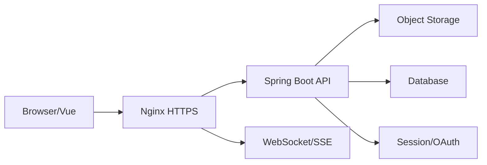

# 全栈交付：契约、认证、上传下载、WebSocket 与 Nginx

完整产品链路需要前后端对齐 API、身份、代理、文件和实时连接，并能以 HTTPS 和自动化部署交付。

## 1. 本文覆盖范围

- OpenAPI 与错误模型
- Cookie/BFF 与 token
- 文件导入导出
- WebSocket/SSE、Nginx 与 HTTPS

## 2. 核心知识详解

### 1. 契约协作

OpenAPI 定义输入、响应、错误和安全方案，生成客户端类型但仍保留运行时校验和兼容测试。

- 分页、时间、金额、枚举和空值语义统一。
- 错误含稳定 code、message、fieldErrors 和 requestId。
- 版本演进添加优先，弃用有观测和期限。

**正确性边界：** 只共享 Java DTO 源码会把内部模型和外部契约耦合，且不能替代 HTTP 语义。

### 2. 浏览器认证

同站 Web 应用可使用 HttpOnly Secure SameSite cookie/BFF；跨域资源服务器使用 OAuth token。CSRF、CORS 和 XSS 分别处理。

- 代理后正确配置 trusted proxy 和外部 scheme。
- cookie domain/path 最小化。
- 登出撤销服务端会话/refresh token。

**正确性边界：** 把长期 token 放 localStorage 会扩大 XSS 窃取后果，应按架构评估更安全的 BFF/cookie。

### 3. 文件导入导出

上传采用 multipart/分片或对象存储直传，服务端校验大小、类型、权限和内容。大导出使用异步任务和临时签名下载。

- 导入结果按行给出成功、错误和幂等标识。
- 文件名使用 Content-Disposition RFC 兼容编码。
- 下载授权在生成和读取时都检查，URL 短期有效。

**正确性边界：** 把大文件完整读入 JVM 堆会造成内存峰值，使用流式、配额和背压。

### 4. 实时通信与代理

SSE 适合服务端单向事件，WebSocket 适合双向低延迟。Nginx/网关配置 Upgrade、超时、buffering、连接数和 TLS。

- 连接建立时认证，长连接期间处理权限变化和 token 过期。
- 消息有序号、心跳、重连和断线补偿。
- HTTPS 自动续期并启用现代 TLS 配置。

**正确性边界：** WebSocket 建连成功后连接可能随时中断，可靠业务仍需持久状态和重同步。

## 3. 工程链路



## 4. 最小可运行示例

下面的示例只保留关键路径。把它放入对应版本的最小工程，先运行测试或命令确认行为，再逐步加入重试、超时、监控和异常分支。

```nginx
location /api/ {
  proxy_pass http://backend;
  proxy_set_header Host $host;
  proxy_set_header X-Forwarded-Proto $scheme;
}
location /ws/ {
  proxy_pass http://backend;
  proxy_http_version 1.1;
  proxy_set_header Upgrade $http_upgrade;
  proxy_set_header Connection "upgrade";
}
```

## 5. 实践与验证

1. 生成 OpenAPI TypeScript 客户端并写兼容测试。
2. 实现流式导入、逐行错误报告和异步导出。
3. 通过 Nginx 发布 HTTPS 与 WebSocket，验证重连和权限失效。

## 6. 掌握检查

- [ ] 能维护契约。
- [ ] 能选择浏览器认证。
- [ ] 能安全流式处理文件。
- [ ] 能运营实时连接和代理。

## 参考资料

- [OpenAPI Specification](https://spec.openapis.org/oas/latest.html)
- [MDN Server-sent events](https://developer.mozilla.org/en-US/docs/Web/API/Server-sent_events)
- [NGINX WebSocket Proxying](https://nginx.org/en/docs/http/websocket.html)
