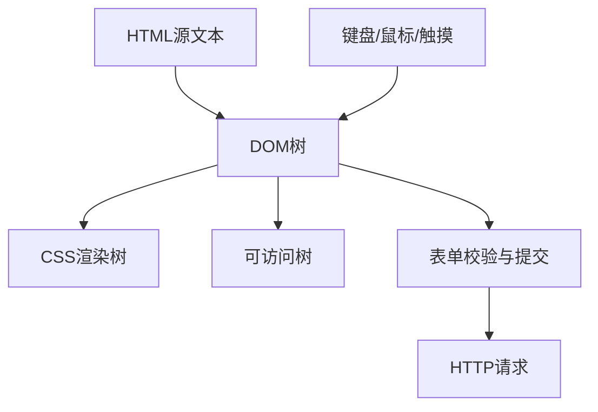

# HTML：语义结构、表单、媒体与可访问性

HTML 定义内容和交互控件的语义。浏览器据此构建 DOM 和可访问树，并提供表单、链接、媒体、焦点与键盘默认行为。语义正确的页面通常更容易测试、维护和被辅助技术使用。

## 1. 学习目标

- 掌握文档骨架和语义分区
- 掌握表单控件、校验与提交
- 理解图片、音视频与响应式资源
- 掌握键盘、焦点、名称和 ARIA 基础

## 2. 核心概念

### 1. 文档结构与语义元素

`<!doctype html>` 启用标准模式；`html/head/body` 构成骨架。`header/nav/main/article/section/aside/footer` 表达区域角色，标题层级描述内容大纲。`button`、`a`、列表和表格应按真实语义选择。

**正确边界：** `section` 通常需要可识别标题；用于布局的无语义容器可使用 `div`，但不要用 `div` 模拟原生按钮。

### 2. 表单与浏览器校验

`form` 通过 method/action/encoding 定义提交。每个控件用 `label for` 获得可访问名称，`name` 决定 FormData 键；`required`、`min/max`、`minlength`、`pattern` 提供约束。服务端必须再次校验。

**正确边界：** placeholder 不是 label；disabled 控件不提交，readonly 控件通常仍提交。

### 3. 媒体与性能

`img` 需要反映用途的 `alt`；装饰图可用空 alt。`picture/srcset/sizes` 让浏览器按视口和像素密度选择资源，显式 width/height 减少布局偏移。音视频应提供字幕和替代信息。

**正确边界：** 不要把重要文字只放进图片；懒加载首屏主图可能延迟最大内容绘制。

### 4. 可访问性

可访问名称来自 label、文本或 ARIA；焦点顺序通常遵循 DOM。先使用原生语义，ARIA 仅补充缺失语义。动态错误用文本关联，模态框需管理初始焦点、焦点约束和关闭后的焦点恢复。

**正确边界：** ARIA 不会自动加入键盘行为、状态管理和视觉样式。

## 3. 运行链路



## 4. 最小示例

```html
<main>
  <h1>创建账号</h1>
  <form id="signup">
    <div>
      <label for="email">邮箱</label>
      <input id="email" name="email" type="email"
             autocomplete="email" required
             aria-describedby="email-help email-error">
      <p id="email-help">用于登录和接收通知。</p>
      <p id="email-error" role="alert" hidden></p>
    </div>
    <button type="submit">创建</button>
  </form>
</main>
```

```javascript
const form = document.querySelector('#signup')
form.addEventListener('submit', event => {
  event.preventDefault()
  if (!form.reportValidity()) return
  const payload = Object.fromEntries(new FormData(form))
  console.log(payload)
})
```

## 5. 练习与验证

1. 只用键盘完成表单
2. 用浏览器可访问树检查控件名称
3. 为图片选择正确 alt 与尺寸

## 6. 常见误区

- 点击文字不能聚焦输入框
- 标题仅按字号选择导致层级跳跃
- 客户端校验被当作安全边界

## 7. 掌握检查

- [ ] 能不用术语堆砌，向初学者解释本主题解决的问题。
- [ ] 能运行示例并观察正常、边界和失败分支。
- [ ] 能说明该能力在完整 Java 后端链路中的位置和替换边界。
- [ ] 能以测试、执行计划、指标或规范条款验证关键结论。

## 参考资料

- [MDN Structuring content with HTML](https://developer.mozilla.org/en-US/docs/Learn_web_development/Core/Structuring_content)
- [MDN Web forms](https://developer.mozilla.org/en-US/docs/Learn_web_development/Extensions/Forms)
- [WAI-ARIA Authoring Practices](https://www.w3.org/WAI/ARIA/apg/)
