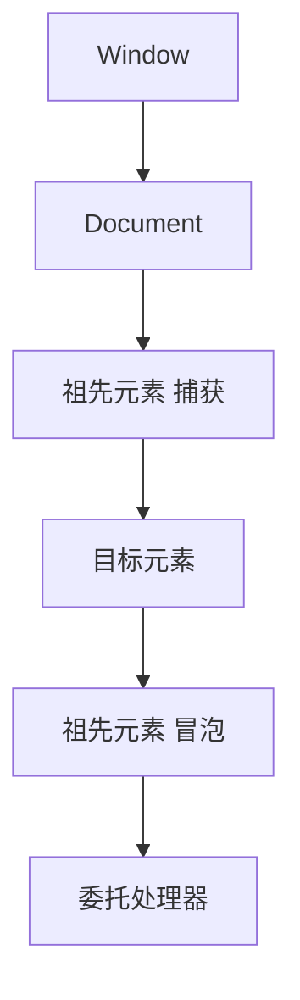

# JavaScript 基础：类型、函数、集合、DOM 与事件

JavaScript 是动态类型、基于原型、拥有词法作用域和一等函数的语言。浏览器把它与 DOM、事件、网络和存储 API 组合成前端运行环境。

## 1. 学习目标

- 理解原始类型、对象、相等和类型转换
- 掌握作用域、闭包、函数和 this
- 掌握数组/对象不可变更新
- 掌握 DOM 查询、事件传播和委托

## 2. 核心概念

### 1. 值、类型与相等

原始值包括 undefined、null、boolean、number、bigint、string、symbol；对象按引用比较。`===` 通常避免隐式转换，`Object.is` 对 NaN 和正负零语义不同。`null` 表示有意空值，`undefined` 常表示缺失。

**正确边界：** `typeof null` 历史上返回 `"object"`；数组用 `Array.isArray` 检查。

### 2. 作用域、闭包与 this

`let/const` 是块级词法作用域；闭包让函数保留定义位置的变量。普通函数的 `this` 由调用方式决定，箭头函数捕获外层 this 且没有自己的 arguments。

**正确边界：** 闭包可能延长对象生命期；事件监听和计时器应在组件销毁时清理。

### 3. 数组与对象

`map/filter/reduce/find/some/every` 表达集合变换；spread 只做浅拷贝，嵌套对象仍共享引用。`Map` 支持任意键，`Set` 表达唯一集合。

**正确边界：** `sort()` 默认按字符串且原地修改；数字排序需比较器，保留原数组可用 `toSorted()`。

### 4. DOM 与事件

DOM 是节点树。事件先捕获到目标，再冒泡；事件委托把监听器放在稳定祖先，用 `closest` 找实际目标，适合动态列表。`preventDefault` 取消默认动作，`stopPropagation` 阻止传播。

**正确边界：** 阻止默认动作不等于阻止冒泡；过度 stopPropagation 会破坏组合。

## 3. 运行链路



## 4. 最小示例

```javascript
const state = {
  orders: [
    { id: 1, status: 'PENDING' },
    { id: 2, status: 'PAID' },
  ],
}

const pending = state.orders
  .filter(order => order.status === 'PENDING')
  .map(order => ({ ...order, label: `订单 #${order.id}` }))

document.querySelector('#orders').addEventListener('click', event => {
  const button = event.target.closest('button[data-order-id]')
  if (!button) return
  const id = Number(button.dataset.orderId)
  if (!Number.isSafeInteger(id)) return
  console.log('open', id)
})
```

## 5. 练习与验证

1. 用闭包实现计数器并解释变量生命周期
2. 比较浅拷贝与结构化克隆
3. 用事件委托实现可增删列表

## 6. 常见误区

- 使用 var 造成循环闭包混淆
- 直接修改共享数组导致状态难追踪
- 对可能不存在的 DOM 节点直接调用方法

## 7. 掌握检查

- [ ] 能不用术语堆砌，向初学者解释本主题解决的问题。
- [ ] 能运行示例并观察正常、边界和失败分支。
- [ ] 能说明该能力在完整 Java 后端链路中的位置和替换边界。
- [ ] 能以测试、执行计划、指标或规范条款验证关键结论。

## 参考资料

- [MDN JavaScript Guide](https://developer.mozilla.org/en-US/docs/Web/JavaScript/Guide)
- [MDN DOM Introduction](https://developer.mozilla.org/en-US/docs/Web/API/Document_Object_Model/Introduction)
- [MDN Event bubbling](https://developer.mozilla.org/en-US/docs/Learn_web_development/Core/Scripting/Event_bubbling)
