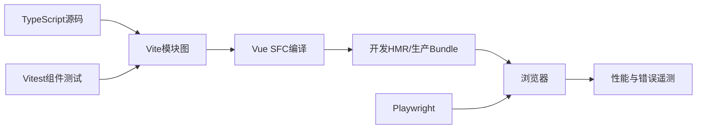

# TypeScript、Vue 工程化、测试与性能

TypeScript 在编译期检查 JavaScript 程序，Vue 用响应式系统与组件组织界面，Vite 等工具完成开发服务器和生产构建。可靠前端还需要运行时数据校验、状态边界、路由、测试、可访问性和性能预算。

## 1. 学习目标

- 掌握联合类型、窄化、泛型与类型守卫
- 掌握 Vue Composition API 与组件通信
- 理解路由、状态、表单和请求状态
- 建立单元、组件、E2E 与性能验证

## 2. 核心概念

### 1. TypeScript 类型系统

联合类型表达多个可能，判别字段帮助穷尽分支；泛型保留输入输出关系；`unknown` 迫使使用前缩小，优于 `any`；`satisfies` 检查约束同时保留具体推断。

**正确边界：** 类型在编译后擦除，服务器 JSON、localStorage 和用户输入仍需运行时 schema 校验。

### 2. Vue 响应式

`ref/reactive` 保存源状态，`computed` 表达无副作用派生值，`watch/watchEffect` 用于副作用。组件通过 props 输入、emit 输出；slot 传递视图结构，provide/inject 适合跨层依赖。

**正确边界：** computed 不应发请求或修改其他状态；watch 创建的异步工作需要失效清理。

### 3. 应用状态与路由

URL 保存可分享的导航状态，本地组件保存短生命周期 UI 状态，Pinia 等全局 store 保存跨页面共享领域状态，服务器状态需要缓存、失效、加载和错误语义。

**正确边界：** 不是所有 API 响应都应永久复制到全局 store。

### 4. 测试与性能

Vitest 测试纯逻辑，Vue Test Utils 测组件可观察行为，Playwright 覆盖关键用户流程。性能从 bundle、请求瀑布、渲染、长任务、图片和缓存建立预算。

**正确边界：** 快照测试不能代替语义断言和可访问查询；E2E 数量过多会增加反馈时间与不稳定。

## 3. 运行链路



## 4. 最小示例

```vue
<script setup lang="ts">
import { computed, onWatcherCleanup, ref, watch } from 'vue'

type LoadState<T> =
  | { status: 'idle' | 'loading' }
  | { status: 'success'; data: T }
  | { status: 'error'; message: string }

const query = ref('')
const state = ref<LoadState<readonly string[]>>({ status: 'idle' })
const canSearch = computed(() => query.value.trim().length >= 2)

watch(query, async value => {
  if (!canSearch.value) return
  const controller = new AbortController()
  onWatcherCleanup(() => controller.abort())
  state.value = { status: 'loading' }
  try {
    const response = await fetch(`/api/search?q=${encodeURIComponent(value)}`, {
      signal: controller.signal,
    })
    if (!response.ok) throw new Error(`HTTP ${response.status}`)
    state.value = { status: 'success', data: await response.json() }
  } catch (error) {
    if (!controller.signal.aborted) {
      state.value = { status: 'error', message: String(error) }
    }
  }
})
</script>
```

```typescript
import { mount } from '@vue/test-utils'
import { expect, test } from 'vitest'
import SearchBox from './SearchBox.vue'

test('少于两个字符时不启用搜索', async () => {
  const wrapper = mount(SearchBox)
  await wrapper.get('input').setValue('a')
  expect(wrapper.get('button').attributes('disabled')).toBeDefined()
})
```

## 5. 练习与验证

1. 用判别联合覆盖加载状态
2. 测试 watch 清理旧请求
3. 设置 bundle 大小与关键页面性能预算

## 6. 常见误区

- 用类型断言隐藏真实不确定性
- 解构 reactive 后丢失响应式连接
- 只测组件内部实现而不测用户可见结果

## 7. 掌握检查

- [ ] 能不用术语堆砌，向初学者解释本主题解决的问题。
- [ ] 能运行示例并观察正常、边界和失败分支。
- [ ] 能说明该能力在完整 Java 后端链路中的位置和替换边界。
- [ ] 能以测试、执行计划、指标或规范条款验证关键结论。

## 参考资料

- [TypeScript Handbook](https://www.typescriptlang.org/docs/handbook/intro.html)
- [Vue Guide](https://vuejs.org/guide/introduction.html)
- [Vue Watchers](https://vuejs.org/guide/essentials/watchers)
- [Vitest Guide](https://vitest.dev/guide/)
- [Playwright Documentation](https://playwright.dev/docs/intro)
