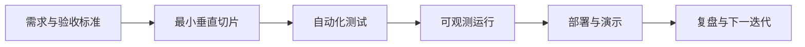

# Java 后端项目阶梯：从零开始的阶段导学

> 这一页是本阶段的入口，不假设读者已经接触过对应框架。先建立“为什么需要它、它在链路中的位置、如何验证”的心智模型，再进入各专题。

## 1. 本阶段解决什么问题

把零散知识组织成逐步增加约束的可运行系统。每个项目都要求需求、架构、代码、测试、运行、观测、发布与复盘证据；下一阶段只在当前阶段可验证后增加复杂度。

### 前置知识

- 完成 Java 基础和至少一个 Spring Boot CRUD 服务
- 会使用 Git、构建工具和自动化测试

## 2. 零基础词汇与心智模型

### 1. 垂直切片

按一个可交付用户场景贯穿接口、业务、数据和测试，而不是先把所有 controller 或表一次写完。

**学会的证据：** 每个迭代都有端到端可演示结果。

### 2. 模块化单体

在单一部署单元内保持清晰模块边界，减少分布式复杂度并为未来拆分提供证据。

**学会的证据：** 模块依赖可被架构测试验证。

### 3. 验收标准

验收标准是可观察且可测试的成功条件，应覆盖正常、边界、错误与非功能目标。

**学会的证据：** 需求条目能映射到自动化测试或演示脚本。

### 4. 工程证据

README、架构决策、测试报告、迁移、仪表盘、发布记录和复盘比技术名词列表更能证明能力。

**学会的证据：** 陌生人可按文档在新环境运行项目。

## 3. 建议学习顺序

1. 模块化单体任务系统
2. 事件驱动订单与库存
3. 云原生高可用平台
4. 整理作品集与可复现证据

## 4. 完整链路



## 5. 最小代码切片

```java
record Acceptance(String scenario, boolean automated, String evidence) {}
```

## 6. 第一个可验证练习

选择“创建任务并按状态查询”作为第一条切片，提交 API 契约、数据库迁移、领域测试、集成测试、容器启动命令和演示脚本。

## 7. 初学者容易混淆的边界

- 一次堆入过多中间件会掩盖核心设计
- 只有截图没有复现步骤不构成工程证据
- 项目复杂度应由需求和失败模式驱动

## 8. 阶段验收

- [ ] 能把需求拆成垂直切片
- [ ] 能提供一键验证路径
- [ ] 能解释每个组件为何存在及删除它的影响

## 参考资料

- [Spring Petclinic](https://github.com/spring-projects/spring-petclinic)
- [The Twelve-Factor App](https://12factor.net/)
- [C4 Model](https://c4model.com/)
