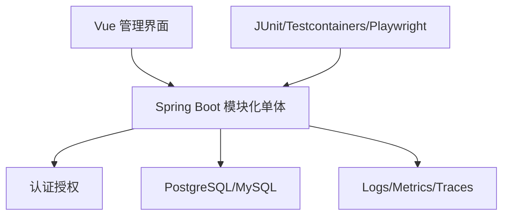

# 项目一：模块化单体任务系统

以任务/知识管理为业务，练习 Java、Spring Boot、SQL、认证、测试和容器的完整单体交付。

## 1. 本文覆盖范围

- 领域与模块边界
- REST/校验/错误
- 数据库事务与查询
- 认证、测试、容器和观测

## 2. 核心知识详解

### 1. 领域建模

用户、项目、任务、标签和审计形成明确聚合；状态迁移由领域服务维护，不允许控制器直接随意写状态。

- 写状态机和不变量表。
- 数据库约束与领域校验双层保护。
- 模块通过公开服务接口交互。

**正确性边界：** 模块化单体不是按 controller/service/repository 横向分包，而是先按业务能力分模块。

### 2. 数据与 API

使用版本化迁移、事务、索引和稳定分页。API 有 OpenAPI、统一错误、幂等创建和对象级授权。

- 对列表查看执行计划。
- 并发更新用版本列。
- 审计记录关键状态变化。

**正确性边界：** 只完成 CRUD 不足以验证后端能力，必须包含并发、错误和权限路径。

### 3. 质量

领域单元测试、数据库 Testcontainers、Web 集成测试和少量浏览器旅程组成测试组合。

- CI 阻止失败构建。
- 测试数据独立。
- 覆盖跨租户和越权。

**正确性边界：** 覆盖率达到阈值仍可能遗漏关键不变量，应以风险清单验收。

### 4. 交付

Docker Compose 启动应用和数据库，Actuator、结构化日志、指标和 trace 支持诊断。

- README 一条命令启动。
- 示例数据和演示账号可重建。
- 备份、迁移、回滚和 runbook 齐全。

**正确性边界：** 能启动不等于可运营；必须演示一次错误定位和恢复。

## 3. 工程链路



## 4. 最小可运行示例

下面的示例只保留关键路径。把它放入对应版本的最小工程，先运行测试或命令确认行为，再逐步加入重试、超时、监控和异常分支。

```java
public sealed interface Command permits CreateOrder {}
public record CreateOrder(UUID requestId, long customerId) implements Command {}

public interface CommandHandler<C extends Command, R> {
  R handle(C command);
}
```

## 5. 实践与验证

1. 完成状态机、权限矩阵、ER 图和 API 契约。
2. 加入并发更新、幂等和跨租户测试。
3. 演示 Compose 部署、迁移、观测和回滚。

## 6. 掌握检查

- [ ] 模块边界清晰。
- [ ] 数据和权限有测试。
- [ ] 构建部署可重复。
- [ ] 有诊断与恢复证据。

## 参考资料

- [Spring Modulith](https://docs.spring.io/spring-modulith/reference/)
- [Spring REST Docs](https://docs.spring.io/spring-restdocs/docs/current/reference/htmlsingle/)
- [Testcontainers for Java](https://java.testcontainers.org/)
