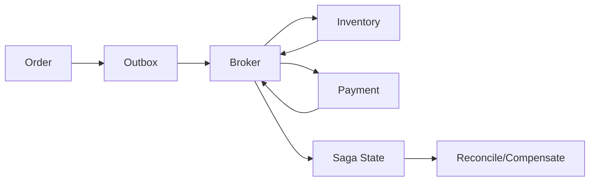

# 项目二：事件驱动订单、库存与支付系统

在明确业务不变量后拆分订单、库存、支付和通知，练习事件、幂等、Outbox、Saga、缓存与故障治理。

## 1. 本文覆盖范围

- 服务和数据所有权
- Outbox/消息/幂等
- Saga 与对账
- 容量、故障和可观测

## 2. 核心知识详解

### 1. 边界与不变量

订单拥有订单状态，库存拥有可售数量，支付拥有资金状态；跨服务通过命令/事件和显式查询协作。

- 禁止共享业务表。
- 每个状态迁移有前置条件和版本。
- 定义重复、乱序、延迟和缺失事件处理。

**正确性边界：** 按技术层拆服务会造成高耦合分布式单体。

### 2. 可靠事件

本地事务写业务与 outbox，发布到 Kafka/RabbitMQ/RocketMQ，消费者以 event id 和状态条件幂等。

- schema version 和契约测试。
- 重试/死信/replay 可审计。
- 监控 lag 与最老事件。

**正确性边界：** 消息 broker 的持久化不覆盖数据库双写一致性。

### 3. Saga 和对账

下单编排库存预留、支付确认和发货，失败执行释放/退款等补偿，并为未知状态建立查询和人工流程。

- 状态机持久化。
- 补偿幂等。
- 定期对账订单、支付和库存。

**正确性边界：** 补偿是新业务动作，可能失败或不可逆，不能写成简单反向函数。

### 4. 韧性与观测

网关限流，调用传播 deadline，依赖熔断；trace 关联 HTTP 和消息，SLO 覆盖下单成功与最终完成时间。

- 故障演练 broker/数据库/单服务延迟。
- 容量测试识别分区和热点。
- canary 有自动停止。

**正确性边界：** 只看 HTTP 延迟会遗漏异步业务完成的用户体验。

## 3. 工程链路

## 4. 实践与验证

1. 写出不变量、事件目录和 Saga 状态图。
2. 注入消息重复、乱序和发布器崩溃。
3. 演示异步 SLO、lag 告警和对账修复。

## 5. 掌握检查

- [ ] 数据所有权明确。
- [ ] 事件链路可重放。
- [ ] Saga 可恢复。
- [ ] 异步体验可观测。

## 参考资料

- [Apache Kafka Documentation](https://kafka.apache.org/documentation/)
- [RabbitMQ Documentation](https://www.rabbitmq.com/docs)
- [Microservices Patterns](https://microservices.io/patterns/)
