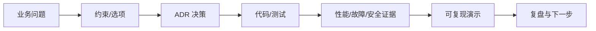

# 作品集验收、文档与面试证据

高质量作品集展示决策、正确性、测试、性能和运营证据，而不是只列框架名和截图。

## 1. 本文覆盖范围

- README 与架构记录
- 测试和质量证据
- 性能与故障报告
- 演示、复盘和面试表达

## 2. 核心知识详解

### 1. 可复现 README

README 写出问题、架构、版本、前置条件、一条命令启动、配置、测试、演示账号、限制和许可证。

- 锁定工具版本。
- 提供架构图、ER 图和关键序列图。
- 敏感配置使用模板。

**正确性边界：** 只有 API 列表而没有业务目标和运行步骤，评审者难以验证能力。

### 2. ADR 与权衡

Architecture Decision Record 记录背景、选项、选择、后果和复审条件，例如数据库、消息、缓存和一致性方案。

- 保留被拒方案及理由。
- 结论关联基准/文档/实验。
- 过期决策由新 ADR supersede。

**正确性边界：** 事后把现状包装成唯一正确方案，不是有效架构决策记录。

### 3. 证据包

CI 报告、覆盖的风险清单、执行计划、JFR/压测、SLO、故障时间线、恢复演练和安全扫描形成可核验材料。

- 数据脱敏。
- 报告含环境和版本。
- 失败和改进同样保留。

**正确性边界：** 单张“QPS 很高”截图缺少负载、正确性和资源信息，结论不可复现。

### 4. 表达方法

用“问题—约束—选项—决策—验证—结果—后续”讲项目；被追问时能下钻到协议、事务、线程和 SQL。

- 准备一次 5 分钟演示和一次 30 分钟深挖。
- 明确自己负责部分。
- 诚实说明边界和未完成项。

**正确性边界：** 背诵术语而讲不出失败模式、指标和代码位置，难以证明掌握。

## 3. 工程链路



## 4. 最小可运行示例

下面的示例只保留关键路径。把它放入对应版本的最小工程，先运行测试或命令确认行为，再逐步加入重试、超时、监控和异常分支。

```java
public final class Example {
  private Example() {}

  public static <T> List<T> immutableCopy(Collection<? extends T> source) {
    Objects.requireNonNull(source, "source");
    return List.copyOf(source);
  }
}
```

## 5. 实践与验证

1. 为项目写一份完整 README 和两份 ADR。
2. 整理可匿名复现的测试、性能和故障证据包。
3. 录制 5 分钟部署与故障恢复演示并按清单复盘。

## 6. 掌握检查

- [ ] 他人能独立启动。
- [ ] 决策有证据。
- [ ] 质量和性能可复现。
- [ ] 能清晰表达边界与改进。

## 参考资料

- [Architecture Decision Records](https://adr.github.io/)
- [C4 Model](https://c4model.com/)
- [Semantic Versioning](https://semver.org/)
