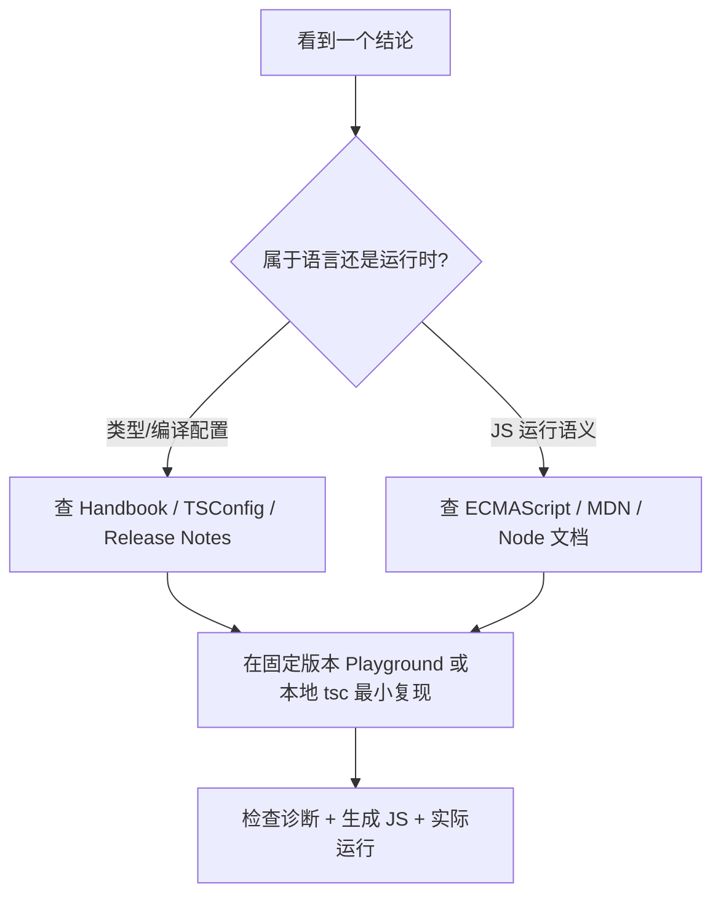

# TypeScript 官方资料、学习顺序与版本边界

这是一份“入口文档”。它说明资料优先级、TypeScript 7.0 的版本背景，以及遇到网络文章与本知识库不一致时如何验证。

## 1. 一手资料索引

### 核心学习资料

- [TypeScript Documentation](https://www.typescriptlang.org/docs/)：文档总入口。
- [The TypeScript Handbook](https://www.typescriptlang.org/docs/handbook/)：日常语言能力主线。
- [TSConfig Reference](https://www.typescriptlang.org/tsconfig/)：逐项核对编译器配置。
- [TypeScript Playground](https://www.typescriptlang.org/play)：快速查看诊断与 JavaScript 输出。
- [TypeScript Release Notes](https://www.typescriptlang.org/docs/handbook/release-notes/overview.html)：确认版本新增、废弃和破坏性变化。
- [Announcing TypeScript 7.0](https://devblogs.microsoft.com/typescript/announcing-typescript-7-0/)：7.0 原生编译器、迁移和兼容性说明。

### 按主题阅读

| 主题 | 官方页面 |
| --- | --- |
| 日常类型 | [Everyday Types](https://www.typescriptlang.org/docs/handbook/2/everyday-types.html) |
| 控制流分析 | [Narrowing](https://www.typescriptlang.org/docs/handbook/2/narrowing.html) |
| 函数 | [More on Functions](https://www.typescriptlang.org/docs/handbook/2/functions.html) |
| 对象 | [Object Types](https://www.typescriptlang.org/docs/handbook/2/objects.html) |
| 类 | [Classes](https://www.typescriptlang.org/docs/handbook/2/classes.html) |
| 泛型 | [Generics](https://www.typescriptlang.org/docs/handbook/2/generics.html) |
| 类型兼容 | [Type Compatibility](https://www.typescriptlang.org/docs/handbook/type-compatibility.html) |
| 模块解析 | [Modules: Theory](https://www.typescriptlang.org/docs/handbook/modules/theory.html) |
| 声明文件 | [Declaration Files](https://www.typescriptlang.org/docs/handbook/declaration-files/introduction.html) |
| 工具类型 | [Utility Types](https://www.typescriptlang.org/docs/handbook/utility-types.html) |

## 2. TypeScript 7.0 的正确定位

TypeScript 7.0 于 2026 年发布，核心编译器和语言服务从 JavaScript/TypeScript 代码库迁移到 Go 原生实现，主要目标是显著改善检查和编辑器性能。它尽量保持 TypeScript 6.0 的类型检查与命令行行为兼容，但仍有三个工程边界：

1. 7.0 采用 6.0 的新默认值并移除 6.0 已废弃选项；旧 `tsconfig` 应先在 6.0 清理警告。
2. 7.0 初版不提供旧编译器 API；依赖 `typescript` 编程 API 的工具可能暂时需要 TypeScript 6 兼容包。
3. 语言语义与编译器实现语言是两回事：编译器改为 Go，不代表业务代码在 Go 运行；输出仍是 JavaScript。

### 新项目安装

```bash
npm init -y
npm install --save-dev typescript@latest
npx tsc --version
```

团队项目应提交 `package.json` 与锁文件，用 `npm ci` 复现版本，而不是依赖全局 `tsc`。

### 仍依赖 TypeScript 6 编程 API 的项目

以下配置展示官方提供的并行策略。只有工具链确实依赖旧 API 时才使用：

```json
{
  "devDependencies": {
    "@typescript/native": "npm:typescript@^7.0.2",
    "typescript": "npm:@typescript/typescript6@^6.0.2"
  }
}
```

此时要分别确认 `tsc`/`tsc6` 命令来自哪个包；不要仅凭包名推断执行器。

## 3. 如何验证一个 TypeScript 结论



最小复现至少记录：TypeScript 版本、`tsconfig`、输入 `.ts`、编译诊断和输出 `.js`。只截编辑器红线但不记录版本与配置，结论不可复现。

## 4. 文档中的术语约定

- **值空间**：运行时真实存在的变量、函数、类、枚举对象等。
- **类型空间**：只供检查器使用的接口、类型别名、类型参数等。
- **emit**：从 TypeScript 产生 JavaScript 或声明文件。
- **host/runtime**：浏览器、Node.js、Deno 等为 JavaScript 提供 I/O 和模块加载的环境。
- **soundness**：类型系统是否拒绝所有可能导致指定类型错误的程序。TypeScript 为兼容 JavaScript 采用若干有意的不完备/不健全规则，不能把通过类型检查理解为绝对正确。

## 5. Freshness metadata

- `last_verified`: `2026-08-26`
- `version_scope`: `TypeScript 7.0；兼顾 6.0 与 5.x 迁移`
- `source_type`: `TypeScript 官方文档、官方博客`
- `stability`: `fast-moving`

