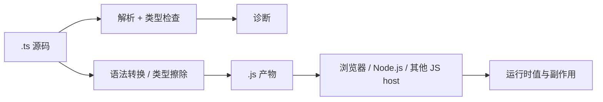

# TypeScript 运行模型、类型擦除与编译产物

TypeScript 是 JavaScript 的静态类型检查层和工具链，不是独立应用运行时。理解这条边界，可以避免“类型写了为什么线上还出错”的根本误解。

## 1. 从源码到执行



`noEmitOnError` 关闭时，`tsc` 即使报告类型错误也可能输出 JavaScript；需要阻止错误产物时显式开启或让 CI 在非零退出码后停止。`noEmit` 则只检查、不生成文件。

## 2. 类型空间与值空间

```typescript
interface User {
  id: string
}

class Session {
  constructor(readonly user: User) {}
}

const session = new Session({ id: "u-1" })
console.log(session instanceof Session)
```

- `User` 只在类型空间存在，输出中没有 `User`，也不能写 `value instanceof User`。
- `Session` 同时产生实例类型和运行时构造函数，因此能用于 `new`、`instanceof`。
- `import type` 明确只导入类型，可避免无意义的运行时依赖。

```typescript
import type { User } from "./user.js"
```

## 3. 类型断言不做转换

```typescript
const payload: unknown = JSON.parse('{"id":123}')
const user = payload as { id: string }

// 编译器相信 id 是 string；运行时实际是 number。
console.log(typeof user.id) // "number"
```

`as` 只改变检查器视角。真实边界要写验证器：

```typescript
type User = { id: string }

function parseUser(input: unknown): User {
  if (
    typeof input !== "object" ||
    input === null ||
    !("id" in input) ||
    typeof input.id !== "string"
  ) {
    throw new TypeError("Invalid User payload")
  }
  return { id: input.id }
}
```

## 4. 哪些 TypeScript 语法可能产生运行时代码

| 构造 | 常见 emit 行为 | 注意 |
| --- | --- | --- |
| 类型标注、`interface`、`type` | 擦除 | 无运行时验证 |
| `class` | 保留/降级为 JS 类模式 | 类本身是值 |
| 普通 `enum` | 通常生成对象 | 与联合字面量不同 |
| `namespace` | 可生成对象封装 | 现代模块项目通常少用 |
| 参数属性 | 生成字段赋值 | 属于 TS 特有可执行语法 |
| 装饰器 | 依目标与配置生成调用 | 现代与 legacy 语义不同 |
| `const enum` | 可能内联 | 跨包和 isolated 转换需谨慎 |

TypeScript 7 对“可擦除语法”与旧配置有更严格边界；依赖仅剥离类型的运行器时，优先使用能直接擦除的类型语法。

## 5. `target`、`lib` 与运行时不是同一项

- `target` 控制 TypeScript 将某些新 JavaScript 语法降级到哪个 ECMAScript 版本。
- `lib` 控制检查时可见的标准 API 声明，例如 `ES2024`、`DOM`。
- 两者都不会自动安装 polyfill，也不会给旧运行时增加 `fetch`、`Promise` 或新数组方法。

```json
{
  "compilerOptions": {
    "target": "ES2022",
    "lib": ["ES2022", "DOM"]
  }
}
```

上述配置只让编译器认识 DOM 类型；在不提供 DOM 的 Node 环境中调用 `document` 仍会在运行时失败。

## 6. 双重验证方法

学习每个特性时同时执行：

```bash
npx tsc --noEmit
npx tsc --outDir dist
node dist/index.js
```

分别观察：静态诊断、产物形态和运行结果。三者回答的是不同问题，任何一个都不能替代另外两个。

## 7. 核心结论

1. TypeScript 的承诺主要发生在编译/编辑阶段。
2. JavaScript host 决定 I/O、模块加载、事件循环和平台 API。
3. 外部数据、反射、动态属性、错误声明与 `any` 都可能越过静态边界。
4. 可靠程序需要“静态类型 + 运行时校验 + 测试 + 可观测性”，而不是只依赖一种机制。

参考：[The Basics](https://www.typescriptlang.org/docs/handbook/2/basic-types.html)、[Type Declarations](https://www.typescriptlang.org/docs/handbook/2/type-declarations.html)、[Modules: Theory](https://www.typescriptlang.org/docs/handbook/modules/theory.html)。

