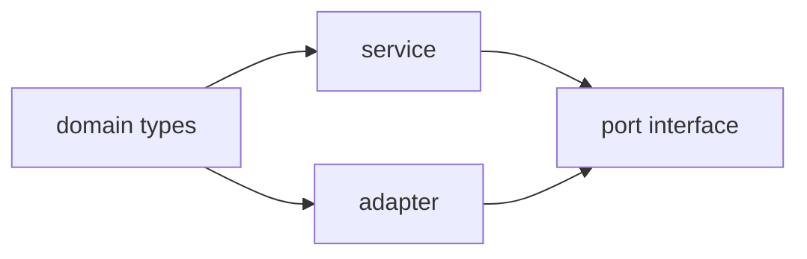

# 模块、包、模块解析与声明文件

模块问题必须同时满足两个系统：TypeScript 要找到类型，运行时/构建器要找到 JavaScript。只修复编辑器红线而忽略运行时路径，会得到“编译通过、启动失败”。

## 1. ESM 基础

```typescript
// math.ts
export const pi = Math.PI
export function area(radius: number): number {
  return pi * radius ** 2
}

// index.ts（NodeNext ESM 源码常写输出扩展名）
import { area } from "./math.js"
console.log(area(2))
```

`import type` 保证导入只用于类型：

```typescript
import type { User } from "./models.js"
```

## 2. 选择模块解析策略

| 场景 | `module` | `moduleResolution` | 重点 |
| --- | --- | --- | --- |
| 现代 Node ESM/CJS | `NodeNext` | `NodeNext` | 遵循 `package.json type`、扩展名、exports |
| Vite/webpack/esbuild | `ESNext` | `Bundler` | 由构建器完成最终解析，允许省略部分相对扩展名 |
| 旧 Node CommonJS | 按项目约束 | 不建议新项目使用旧 `node10` | 迁移时核对依赖 |

TypeScript 6/7 废弃或移除多项旧模块配置，新项目不要复制早期教程中的 `classic`、AMD/UMD/system 或 `baseUrl` 旧习惯。

## 3. `package.json` 导出与类型

```json
{
  "name": "@example/math",
  "type": "module",
  "exports": {
    ".": {
      "types": "./dist/index.d.ts",
      "import": "./dist/index.js"
    }
  },
  "files": ["dist"]
}
```

包发布前应在临时项目执行真实安装测试，而不是只在 monorepo 路径别名下成功。

## 4. `.d.ts` 的作用与边界

```typescript
// index.d.ts
export interface ClientOptions {
  endpoint: URL
  timeoutMs?: number
}

export declare class Client {
  constructor(options: ClientOptions)
  get(path: string): Promise<unknown>
}
```

声明文件只描述一个已经存在的 JavaScript 模块，不生成实现。错误的 `.d.ts` 会让检查器相信错误事实。官方模块理论给出的对应关系包括：

| 声明 | JS | TS 源 |
| --- | --- | --- |
| `.d.ts` | `.js` | `.ts` / `.tsx` |
| `.d.mts` | `.mjs` | `.mts` |
| `.d.cts` | `.cjs` | `.cts` |

## 5. 生成声明

```json
{
  "compilerOptions": {
    "declaration": true,
    "declarationMap": true,
    "emitDeclarationOnly": false,
    "outDir": "dist"
  }
}
```

```bash
npx tsc -p tsconfig.json
npm pack --dry-run
```

公开函数应写稳定返回类型，避免把内部路径、匿名复杂类型或私有依赖泄漏进声明产物。

## 6. 消费第三方类型

优先级：

1. 包自带 `types`/导出声明。
2. 对应 `@types/package-name`。
3. 项目内写最小、准确的声明并配运行测试。

空声明 `declare module "legacy";` 会把整个模块视为 `any`，只适合临时迁移，必须跟踪清理。

## 7. 模块增强与全局声明

```typescript
export {}

declare global {
  interface Window {
    analytics?: { track(name: string): void }
  }
}
```

全局增强应放在模块文件中，并确保运行时确实安装了对应全局值。类型声明不会创建 `window.analytics`。

## 8. 循环依赖与类型导入

类型循环有时可被检查器处理，运行时值循环却可能读到尚未初始化的绑定。用 `import type` 消除纯类型边，并通过依赖倒置拆分真正的运行时环。



## 9. 排错命令

```bash
npx tsc --traceResolution
npm pack --dry-run
node --input-type=module -e "import('@example/math').then(console.log)"
```

`--traceResolution` 解释 TypeScript 为什么选择某个源/声明文件；运行命令验证 host 的真实选择。

参考：[Modules](https://www.typescriptlang.org/docs/handbook/2/modules.html)、[Modules: Theory](https://www.typescriptlang.org/docs/handbook/modules/theory.html)、[Declaration Files](https://www.typescriptlang.org/docs/handbook/declaration-files/introduction.html)。

