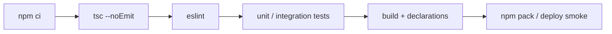

# 测试、构建、Lint、发布与 JavaScript 迁移

TypeScript 的工程闭环至少包含静态检查、运行测试、风格/缺陷规则、构建产物和消费验证。类型检查只覆盖其中一层。

## 1. 推荐质量流水线



```json
{
  "scripts": {
    "typecheck": "tsc --noEmit",
    "lint": "eslint .",
    "test": "vitest run",
    "build": "tsc -p tsconfig.build.json",
    "check": "npm run typecheck && npm run lint && npm test && npm run build"
  }
}
```

## 2. 运行测试与类型测试

```typescript
import { describe, expect, it } from "vitest"

describe("parsePort", () => {
  it("accepts a valid decimal port", () => {
    expect(parsePort("443")).toBe(443)
  })

  it("rejects out-of-range values", () => {
    expect(() => parsePort("70000")).toThrow(RangeError)
  })
})
```

运行测试验证实际值与副作用；类型测试验证某调用应通过或应被拒绝。对预期错误可使用 `// @ts-expect-error`，它在错误消失时也会失败，比 `@ts-ignore` 可审计。

```typescript
// @ts-expect-error invalid method is intentionally rejected
request("INVALID", 0)
```

## 3. Lint 与类型检查分工

- TypeScript 检查类型关系、名称和控制流。
- ESLint 检查未处理 Promise、危险断言、不可达模式、团队约定等。
- Formatter 只负责布局，不判断程序正确性。

启用需要类型信息的 ESLint 规则会增加分析成本，应正确配置项目服务和文件范围，而不是把生成目录也纳入。

## 4. 库发布

发布包至少验证：

```bash
npm run build
npm pack --dry-run
npm pack
```

再在空白临时项目安装生成的 `.tgz`，分别用 ESM、必要时 CJS 真实导入，并运行 `tsc` 验证声明。双模块发布要明确 `exports` 条件，避免同一包被加载两份或类型路径错配。

## 5. 从 JavaScript 渐进迁移

### 阶段 A：先检查 JS

```json
{
  "compilerOptions": {
    "allowJs": true,
    "checkJs": true,
    "noEmit": true
  }
}
```

用 JSDoc 补关键边界：

```javascript
/**
 * @param {string} id
 * @returns {Promise<unknown>}
 */
export async function load(id) {
  // ...
}
```

### 阶段 B：从边界向核心迁移

先转换数据模型、纯函数、公共 API，再处理动态框架胶水。每个 `any` 记录来源和清理条件；外部输入统一为 `unknown`。

### 阶段 C：逐步收紧

开启 `strict` 后按错误类别清理，再加入 `noUncheckedIndexedAccess`、`exactOptionalPropertyTypes`。不要一次用大批断言“消灭红线”，那只是把风险移到运行时。

## 6. TypeScript 6/7 工具迁移

TypeScript 7 的原生实现带来性能提升和配置清理，同时初版编程 API 边界与 6.x 不同。升级顺序：

1. 锁定并升级到 TypeScript 6，清理所有 6.0 deprecation。
2. 使用 `stableTypeOrdering` 定位少量推断差异，但不要把它当长期配置。
3. 清查调用编译器 API、语言服务插件和旧模块选项的工具。
4. 在独立分支用 7.0 跑完整类型测试、声明 emit 与编辑器场景。
5. 必要时短期并行安装官方 TS6 兼容包。

## 7. 可复现发布清单

- [ ] 锁文件已提交，CI 使用干净安装。
- [ ] `typecheck`、Lint、测试、构建全部独立可执行。
- [ ] 声明文件未泄漏私有路径。
- [ ] 产物只包含需要发布的文件。
- [ ] 最低 Node/浏览器版本与语法目标一致。
- [ ] 包的 ESM/CJS 入口和 types 条件真实可消费。
- [ ] source map 与许可证文件正确包含。

参考：[Creating .d.ts from JS](https://www.typescriptlang.org/docs/handbook/declaration-files/dts-from-js.html)、[Publishing Declaration Files](https://www.typescriptlang.org/docs/handbook/declaration-files/publishing.html)、[TypeScript 7.0](https://devblogs.microsoft.com/typescript/announcing-typescript-7-0/)。

## 8. Freshness metadata

- `last_verified`: `2026-08-26`
- `version_scope`: `TypeScript 7.0；迁移自 5.x/6.x`
- `source_type`: `TypeScript 官方文档、官方发布博客`
- `stability`: `fast-moving`

